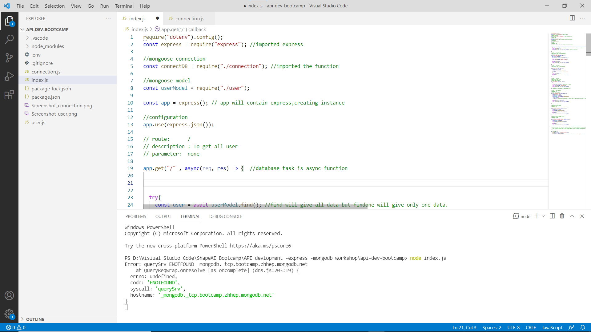
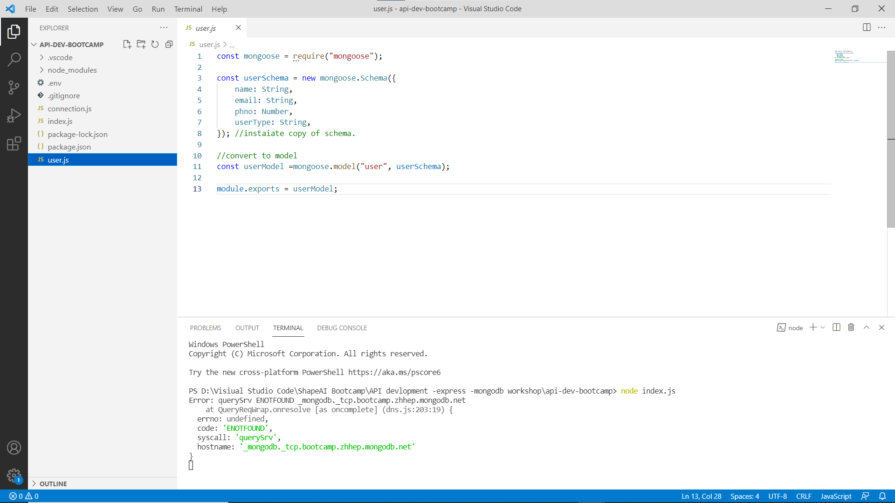
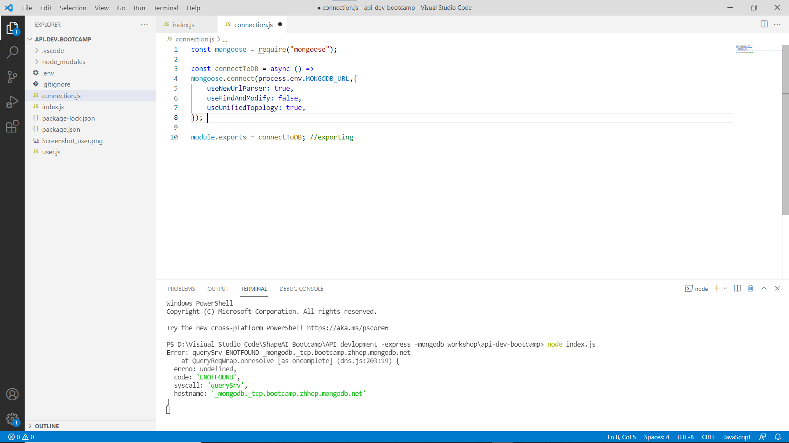

# Application Programming Interface(API)-Development

In these project, I performed on REST client server Development where genrate various request on 

•GET,

•PUT,

•POST,

•DELETE with exception handleing.

•Uses different REST Client platform such as "POSTMAN" where I build,test and modify the api.

•Created with Express,NodeJs framework also uses nodemon for automation of server.

•Mongoose,Mongodb atlas for Database and VScode as IDE.

•In index.js, made all requests of get,put,post and delete.

•In user.js, created schema for user details.

•In connection.js, made connection with mongodb using mongoose.

•You can also create and learn with these examples

*These was created while shapeai bootcamp.
